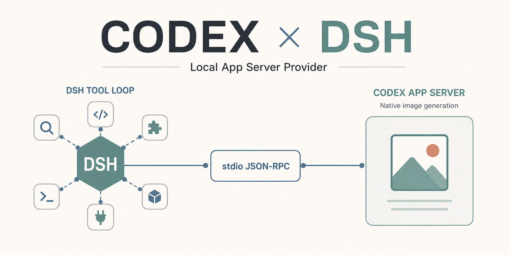

# codex-plugin-dsh

中文 | [English](https://github.com/wingoo/codex-plugin-dsh/blob/main/README.en.md)



在 DeepSeek Harness 里直接使用你本机已经登录的 Codex，无需在 DSH 中配置 OpenAI API Key。安装并重启后，现有模型选择器中会出现 **Codex App Server (local)**，选择模型即可开始对话。

会话和工具调用仍由 DSH 管理，现有 DSH 插件与工具可以照常使用；模型请求通过本地 Codex App Server 连接当前 Codex 账户。插件也支持图片输入，并能把 Codex 原生图片生成结果直接回写到 DSH 对话。

## 快速安装：直接让 DSH 完成

如果当前 DSH 会话具有完整的宿主机权限，把下面这段话直接发给它：

```text
请将 github:wingoo/codex-plugin-dsh 安装到当前 DSH 的 web profile，不要修改 DeepSeek Harness 源码。

1. 检查本机是否已经安装符合插件要求的 Codex CLI；如果尚未安装或版本过旧，请先按照 OpenAI 官方方式安装或升级。
2. 运行 codex login status 检查登录状态。如果尚未登录，请让我在运行 DSH 的主机终端执行 codex login；等我完成浏览器登录并回复“已登录”后再继续。
3. 确认 codex app-server --help 可以正常运行。
4. 安装插件，并通过 dsh --profile web --dump-config 确认 codex-app-server-provider 已加载。
5. 沿用当前 DSH Web 服务原来的启动方式完成重启，不要在同一端口启动第二个实例。重启前提醒我连接会暂时中断。
6. 服务恢复后提醒我刷新页面，并在现有模型选择器中选择 Codex App Server (local)。

如果无法可靠判断原来的启动方式，不要猜测或结束无关进程，直接告诉我应该执行的重启命令。
```

这会修改 DSH profile 并在宿主机上运行插件代码，请先确认仓库来源。重启期间当前连接会暂时中断，服务恢复后刷新页面即可。

## 通过命令行安装

```sh
dsh plugin --profile web add github:wingoo/codex-plugin-dsh
```

如果从 DeepSeek Harness 源码仓库运行：

```sh
pnpm dsh plugin --profile web add github:wingoo/codex-plugin-dsh
```

正式版本发布前，可以锁定已验证的 commit，让安装结果保持一致：

```sh
dsh plugin --profile web add github:wingoo/codex-plugin-dsh#<commit-sha>
```

## 安装本地 checkout

```sh
dsh plugin --profile web add /absolute/path/to/codex-plugin-dsh
```

从 DeepSeek Harness 源码仓库运行时：

```sh
pnpm dsh plugin --profile web add /absolute/path/to/codex-plugin-dsh
```

## 安装后使用

沿用原来的启动方式重启 DSH Web 服务，不要在同一端口启动第二个实例。服务恢复后刷新浏览器，在输入框下方打开现有模型选择器，然后从 **Codex App Server (local)** 分组中选择模型。

空白工作区会话最初使用当前默认模型；发送第一条消息前也可以先切换到 Codex。

## 更新已安装插件：直接让 DSH 完成

已经安装过插件时不需要先卸载。把下面这段话发给具有完整宿主机权限的 DSH 会话：

```text
请把当前 DSH web profile 中已经安装的 codex-plugin-dsh 更新到 GitHub main 的最新版本，不要修改 DeepSeek Harness 源码，也不要先卸载插件。

1. 先运行 command -v dsh，确认当前环境能否直接调用 dsh。
2. 如果可以，运行 dsh plugin --profile web update codex-plugin-dsh；如果没有全局 dsh 命令且当前服务通过 npx 启动，改用 npx --yes @deepseek-ai/dsh plugin --profile web update codex-plugin-dsh。
3. 检查 ~/.dsh/profiles/web/pnpm-lock.yaml，确认 codex-plugin-dsh 的 GitHub tarball commit 已更新；同时运行 dsh --profile web --dump-config（npx 启动时使用对应的 npx 命令）确认 codex-app-server-provider 仍然存在。
4. 更新成功后，沿用当前 Web 服务原来的启动方式重启，不要在同一端口启动第二个实例。重启前提醒我连接会暂时中断。
5. 服务恢复后提醒我刷新页面，并新建一个会话测试 Codex 模型。

如果更新命令被 sandbox 拒绝，请只为这个更新操作请求所需权限；如果无法可靠判断原来的启动方式，不要猜测或结束无关进程，直接告诉我应该执行的重启命令。
```

更新会刷新 GitHub 依赖所解析的 commit，同时保留 web profile 中已有的插件 bundle 配置。

### 通过终端更新

已经安装全局 `dsh` 命令：

```sh
dsh plugin --profile web update codex-plugin-dsh
```

通过 `npx` 运行 DSH：

```sh
npx --yes @deepseek-ai/dsh plugin --profile web update codex-plugin-dsh
```

从 DeepSeek Harness 源码仓库运行：

```sh
pnpm dsh plugin --profile web update codex-plugin-dsh
```

更新完成后必须重启原有 DSH Web 服务，正在运行的进程不会自动加载磁盘上的新插件代码。

## 环境要求

- Node.js `^22.19.0` 或 `>=24`
- DeepSeek Harness `>=0.1.0-rc.5 <0.2.0`
- 本地 Codex CLI `>=0.147.0`
- 已通过 `codex login` 登录的 Codex 账户

### 准备 Codex CLI

本插件使用宿主机上的 Codex CLI，不会代为下载、升级或登录。按照 [OpenAI Codex CLI](https://github.com/openai/codex) 的安装方式准备本机运行时：

```sh
npm install -g @openai/codex
codex login
```

确认运行 DSH 的环境能够找到 Codex，并且 App Server 可用：

```sh
codex --version
codex app-server --help
```

Codex CLI 自己管理账户认证和产品设置；插件不读取或保存 API Key，也不要求把 OpenAI API Key 填入 DSH。

## 当前状态

目前已在 macOS 上使用 DeepSeek Harness `0.1.0-rc.5` 源码包、`0.1.0-rc.6` 发布包和 Codex CLI `0.147.0` 完成验证。本地 bundle 安装、模型发现、Web 端现有模型选择器、真实图片输入、App Server 图片生成回写，以及 DSH 工具调用、结果续跑、附加上下文和工具目录更新均已通过真实 App Server 测试。

Windows 批处理 shim 启动已有单元测试，首个版本发布前仍需在真实 Windows 主机上运行一次。当前 DSH `0.1.0-rc` 安装 service package 时可能输出 peer-dependency warning；插件已显式声明运行时依赖，全新 profile 的 GitHub 安装、Web 启动、模型发现和真实 Codex 回合均已验证通过。

## 配置

安装后会使用安全默认值自动启用。profile 可以在自己的 `cordis.patch.yml` 中覆盖已插入的插件行：

```yaml
- id: codex-app-server-provider
  config:
    executable: codex
    env: {}
    modelCacheMs: 30000
    catalogTimeoutMs: 10000
    turnTimeoutMs: 600000
    disposeGraceMs: 3000
    stderrMaxBytes: 16384
    modelPageSize: 100
```

`executable` 由 DSH 在 subprocess provider 的执行环境中解析，因此如果未来使用远程或沙箱 subprocess provider，Codex 也必须安装在同一个执行环境中。`env` 是显式子进程环境覆盖，不要把凭证写进已提交的 profile。

## 运行行为

- DSH Agent Loop 不会固定调用某个 HTTP API。它使用当前会话选中的 provider／model 调用 DSH LLM service；选择 Codex 后，请求路由到本插件，再通过 stdio 交给本地 Codex App Server。DSH 默认模型只影响尚未显式选择模型的新会话，不是 Codex 路由的第二个上游。
- DSH 会照常完成系统提示和工具组装。插件只接收本次请求的 `options.tools`，不会再次枚举全局工具，因此 preset、scope、allow／deny 和 code mode 的结果不会被绕过或重复。
- App Server 请求 `dsh` namespace 中的动态工具时，插件先返回普通 DSH `tool-call`。DSH Agent Loop 负责权限、调度、执行和 `tool/call`／`tool/result` 日志；下一步 Provider 调用再把结果送回仍在运行的同一个 App Server turn。插件不会自己再执行一遍工具。
- DSH 工具产生的图片结果会作为动态工具图片输出返回给 Codex；`additionalContexts` 会通过 `turn/steer` 进入同一个 turn，而不是被错误拼进工具结果。
- App Server thread 保留动态工具目录。同一目录的后续回合直接从 checkpoint fork，不重复发送；目录变化时会创建新 thread 并从 DSH 持久消息重建可导入历史。
- DSH 会话的工作区会成为 App Server thread 的工作目录，但 App Server 固定使用只读 sandbox 和 `never` approval。Codex 自带 shell、文件修改、Web、MCP、Apps、Plugins、view-image 和 multi-agent 能力会被关闭或拒绝；这些动作只能走 DSH 工具生态。
- Codex 原生 imagegen 是有意保留的例外，它由 App Server 直接完成，不进入 DSH 工具循环。
- DSH 图片附件会先由 attachment service 校验，再以内联 data URL 传给 App Server；不依赖双方共享本地文件路径。
- App Server 完成的图片生成结果会保存为 DSH 图片附件，并作为 assistant 图片显示在原有对话中。能否调用图片生成工具取决于当前 Codex 账户、模型和 App Server 能力，不要求在 DSH 中另配 OpenAI API Key。
- 成功回合会把 App Server thread、turn 和工具目录签名写入 DSH 模型 replay state；后续回合从这个精确 checkpoint 分叉。
- 会话从其他 DSH provider 切换到 Codex 时，已完成的文本、用户图片和工具历史会通过 App Server `thread/inject_items` 方法导入。
- App Server 进程由 DSH subprocess service 管理；一个进程可以跨越同一 DSH turn 的多个工具 step，回合、会话或插件生命周期结束时会按进程树终止。

## 已知限制

- 尚未实现 DSH 交互问题桥接，因此 App Server 的 `item/tool/requestUserInput` 会明确失败。
- 其他 provider 产生的 reasoning block 或 assistant 图片无法导入 App Server；工具目录变化而必须重建 thread 时，已有 Codex reasoning／assistant 图片也无法无损导入。插件会明确失败并要求新建会话，而不是静默丢弃。
- App Server 无法兑现的配置字段（`temperature`、`maxTokens`、`stop`）会被拒绝，不会被静默忽略。

所有权和协议细节见 [docs/architecture.md](docs/architecture.md)。

## 开发

```sh
pnpm install
pnpm run typecheck
pnpm test
pnpm run build
RUN_CODEX_LIVE=1 pnpm run test:live
RUN_CODEX_TOOL_LIVE=1 pnpm run test:live
RUN_CODEX_IMAGE_LIVE=1 pnpm run test:live
```

三条 live 测试分别验证真实图片输入、DSH 动态工具的暂停／续跑／steer／目录继承与更新，以及图片生成和 PNG 回写。它们都会使用宿主机现有的 Codex 登录；图片生成测试只应在确实需要验证该能力时执行。

## License

MIT
